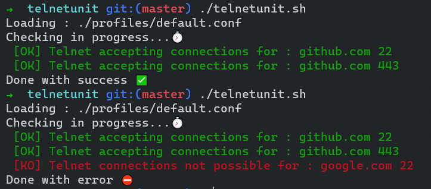
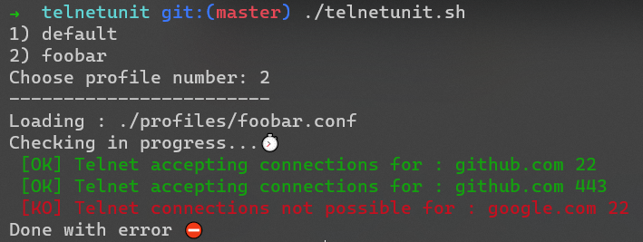

<h1 align="center"></h1>

TELNETUnit is a programmer-oriented testing server openings for network guys. It's just a script to test the access to an address list with the associated port.



## Installation and using

```shell script
git clone git@github.com:romaricp/TELNETUnit.git .
cd telenetunit
chmod +x telenetunit.sh
```

Or [click here to download the .zip (v1.0)](https://github.com/romaricp/TELNETUnit/archive/v1.0.zip) to deposit it on your web server. 

## Default mode
If you want to use it with the default list :
```shell script
./telenetunit.sh
```

**The default list is :** 

* github.com 22
* github.com 443

But you can check the `./profiles/default.conf` file and see all address I'm using for each Symfony's project : 

```shell script
#Use Github           => github.com 443
#Use NPM              => npmjs.org 443
#Use NPM              => registry.npmjs.org 443
#Use Packagist        => packagist.org 443
#Use Google's API     => googleapis.com 443
```

## Custom mode
If you want to use a custom list to check : 
```shell script
cp ./profiles/default.conf my.conf
echo "my_registry.domain.com port_number" >> ./ressources/my.conf
```

And launch :
```shell script
./telenetunit.sh my
```

Or if you want to get the complete profile list 
```shell script
./telenetunit.sh
```


❤️ Use, contribute and enjoy it !  👊  
